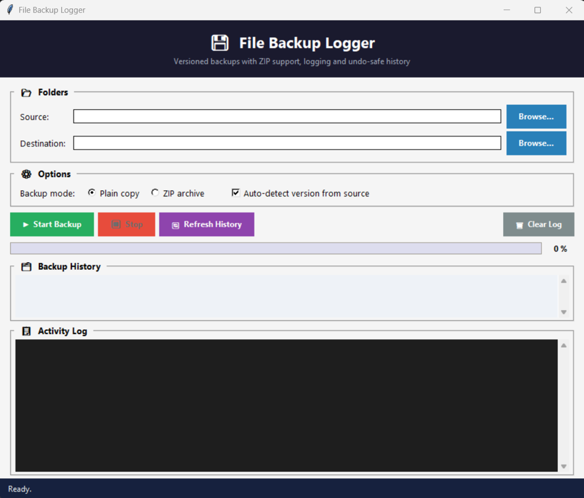

# File Backup Logger

Versioned, logged file backups with ZIP support and a tkinter GUI.



---

## Features

| Feature | Details |
|---|---|
| **Plain copy** | `shutil.copytree()` preserving folder structure |
| **ZIP backup** | `zipfile.ZipFile` with `ZIP_DEFLATED` compression |
| **Versioned names** | `backup_2025-05-01_v2.7.3` (auto-detected) or `backup_2025-05-01_v1` |
| **Auto-version detection** | Reads `package.json`, `pyproject.toml`, `setup.cfg`, … |
| **Structured logging** | `.log` file with timestamp, file count, size, duration, status |
| **Config file** | Preferences stored in `~/.file_backup_logger/config.json` |
| **Retention pruning** | Automatically deletes oldest backups beyond `max_versions` |
| **tkinter GUI** | Folder pickers, mode toggle, progress bar, history, live log |
| **Stoppable** | Click Stop to abort mid-run |
| **Fully tested** | 32 unit tests covering all core classes |

---

## Requirements

- Python ≥ 3.10
- Standard library only (`shutil`, `zipfile`, `tkinter`, `json`, `threading`, …)
- No `pip install` required

---

## Installation

```bash
git clone https://github.com/aranudb/file-backup-logger.git
cd File-Backup-Logger
python main.py
```

---

## Usage

### GUI

```bash
python main.py
```

1. Choose a **Source** folder (what to back up).
2. Choose a **Destination** folder (where backups are stored).
3. Pick **Plain copy** or **ZIP archive**.
4. Click **▶ Start Backup**.
5. Click **⏹ Stop** to abort gracefully after the current file.

### Programmatic

```python
from backup import BackupConfig, BackupEngine, BackupLogger

config = BackupConfig()
config.update({"use_zip": True, "max_versions": 5})

logger = BackupLogger(log_dir="/tmp/logs")
engine = BackupEngine(config=config, logger=logger)

stats = engine.run(
    source      = "/home/user/my_project",
    destination = "/home/user/backups",
)
print(stats.status, stats.files_copied, stats.size_mb)
```

### Running the tests

```bash
python -m unittest test_backup -v
```

Expected: **32 tests, 0 failures**.

---

## Project Structure

```
file_backup_logger/
├── main.py                  ← entry point
├── test_backup.py           ← 32 unit tests
├── README.md
└── backup/
    ├── __init__.py          ← core package exports
    ├── config.py            ← BackupConfig
    ├── versioner.py         ← BackupVersioner
    ├── logger.py            ← BackupLogger
    ├── engine.py            ← BackupEngine + BackupStats
    └── gui.py               ← BackupGUI
```

---

## Architecture

```
                    +-----------+
                    | BackupGUI |   tkinter front-end
                    +-----+-----+
                          | owns
                    +-----v------+
                    | BackupEngine|  core engine
                    +--+---+---+-+
                       |   |   |
           +-----------+   |   +-----------+
           v               v               v
  +--------------+ +---------------+ +-------------+
  | BackupConfig | | BackupVersioner| | BackupLogger|
  +--------------+ +---------------+ +-------------+
```

### Class Overview

| Class | File | Responsibility |
|---|---|---|
| `BackupConfig` | `config.py` | Load/save JSON prefs; forward-compatible defaults |
| `BackupVersioner` | `versioner.py` | Generate versioned names; detect version; prune old backups |
| `BackupLogger` | `logger.py` | Structured `.log` file + console + GUI callbacks |
| `BackupStats` | `engine.py` | Immutable result: files, size, duration, status, errors |
| `BackupEngine` | `engine.py` | Orchestrate: version → copy/zip → log → prune |
| `BackupGUI` | `gui.py` | tkinter: pickers, mode toggle, progress, history, log panel |

---

## Backup Naming

| Situation | Example name |
|---|---|
| `package.json` found with `"version": "2.7.3"` | `backup_2025-05-01_v2.7.3` |
| `pyproject.toml` with `version = "1.0.0"` | `backup_2025-05-01_v1.0.0` |
| No version file found | `backup_2025-05-01_v1`, `…_v2`, … |
| Name already taken | `backup_2025-05-01_v1.0.0_1` |

Supported version files: `package.json`, `pyproject.toml`, `setup.cfg`, `setup.py`, `CMakeLists.txt`, `VERSION`, `version.txt`.

---

## Log Format

```
2025-05-01 14:32:07 | INFO     | START  source='/home/user/project'  dest='/backups'  mode=zip
2025-05-01 14:32:09 | INFO     | BACKUP name=backup_2025-05-01_v2.7.3
                                          source='/home/user/project'
                                          dest='/backups/backup_2025-05-01_v2.7.3.zip'
                                          mode=zip  files=142  size=4.31MB
                                          duration=2.1s  status=OK
2025-05-01 14:32:09 | INFO     | PRUNE  removed=['backup_2025-04-15_v2.6.0']
```

---

## Config File

Located at `~/.file_backup_logger/config.json`:

```json
{
  "source_folder": "/home/user/project",
  "destination_folder": "/home/user/backups",
  "use_zip": false,
  "max_versions": 10,
  "auto_detect_version": true,
  "log_level": "INFO"
}
```